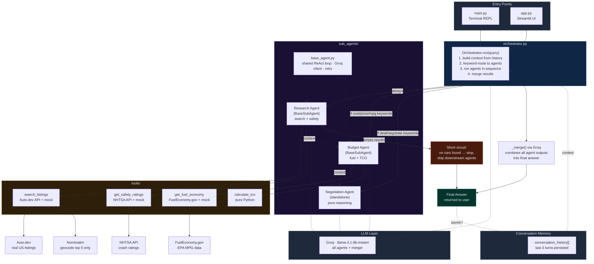

# 🚗 GarageGPT

An AI-powered car buying advisor built in three progressive phases to demonstrate
**agentic AI architecture**, **MCP server development**, and **multi-agent orchestration** —
using only free and open-source tools.

---

## What It Does

GarageGPT helps users find, evaluate, and negotiate used car purchases by:

- Searching real US car listings near your ZIP code (Auto.dev API)
- Fetching official NHTSA crash safety ratings
- Pulling EPA fuel economy data
- Calculating 5-year total cost of ownership
- Providing negotiation tactics and deal assessment

**Example queries:**
> "Find me a reliable SUV under $30,000 with good safety ratings"
> "Compare the Honda CR-V and Toyota RAV4 on safety and 5-year cost"
> "Find me a 2022 BMW X3 M40i near me — is it a good deal?"

---

## Architecture

Built in three phases, each teaching a distinct concept:

### Phase 1 — Single ReAct Agent
One orchestrator agent with a **Reason → Act → Observe** loop. Calls tools directly, manages conversation history, and loops until it has enough to answer. Runs from the terminal.

```
main.py → react_agent.py (ReAct loop) → tools/
```

### Phase 2 — MCP Server
The same tools exposed over the **Model Context Protocol**. Claude Desktop becomes the brain — no ReAct loop needed. Connect once, query from Claude's native chat interface.

```
Claude Desktop → server.py (MCP) → tools/
```

### Phase 3 — Multi-Agent Orchestration
Tools split across three specialist sub-agents, coordinated by an Orchestrator that routes by intent, passes context forward, and merges results.

```
Orchestrator
  ├── Research Agent   → search_listings + get_safety_ratings
  ├── Budget Agent     → get_fuel_economy + calculate_tco
  └── Negotiation Agent → deal assessment (pure reasoning)
```

---

## Project Structure

```
garagegpt/
├── agent/
│   ├── react_agent.py          # Phase 1: single ReAct loop agent
│   ├── prompts.py              # Phase 1: system prompt + tool schemas
│   ├── orchestrator.py         # Phase 3: routes + sequences sub-agents
│   └── sub_agents/
│       ├── base_agent.py       # Shared ReAct loop (inherited by Research + Budget)
│       ├── research_agent.py   # Finds cars + safety ratings
│       ├── budget_agent.py     # Fuel economy + TCO calculation
│       └── negotiation_agent.py # Deal tactics (no tools, pure reasoning)
├── tools/
│   ├── search_listings.py      # Auto.dev API (real listings) + mock fallback
│   ├── safety_ratings.py       # NHTSA API + mock fallback
│   ├── fuel_economy.py         # FuelEconomy.gov API + mock fallback
│   └── calculate_tco.py        # Pure Python TCO math
├── server.py                   # Phase 2: FastMCP server
├── main.py                     # Entry point (Phase 3 by default)
├── run_single_agent.py         # Test one agent in isolation
├── test_tools.py               # Verify all tools work
└── trace_demo.py               # Walk one query end-to-end (no API key needed)
```

---

## Tech Stack

| Component | Tool | Notes |
|---|---|---|
| LLM | Groq (`llama-3.1-8b-instant`) | Free tier, fast |
| Agent framework | Custom ReAct loop | No LangChain — built from scratch |
| MCP SDK | `mcp[cli]` (FastMCP) | Anthropic's official Python SDK |
| Car listings | Auto.dev API | Free Starter tier, real US inventory |
| Safety data | NHTSA API | Free, official US government |
| Fuel economy | FuelEconomy.gov API | Free, official EPA data |
| TCO calculator | Pure Python | No external dependency |

---

## Setup

### 1. Clone and install

```bash
git clone https://github.com/your-username/garagegpt.git
cd garagegpt
pip install -r requirements.txt
```

### 2. Configure API keys

Copy `.env.example` to `.env` and fill in your keys:

```bash
cp .env.example .env
```

```env
# Required — free at https://console.groq.com
GROQ_API_KEY=your_groq_key_here

# Optional — free at https://auto.dev (real listings)
# Without this, falls back to mock data automatically
AUTODEV_API_KEY=your_autodev_key_here

# Only needed for Phase 1 react_agent.py
GEMINI_API_KEY=your_gemini_key_here
```

### 3. Verify tools work (no API key needed)

```bash
python test_tools.py
```

### 4. Run Phase 3 (multi-agent)

```bash
python main.py
```

---

## Usage

### Phase 3 — Full multi-agent (recommended)

```bash
python main.py
```

The Orchestrator automatically routes your query to the right agents:

| Query type | Agents invoked |
|---|---|
| "Find me a safe SUV" | Research only |
| "Find a Honda CR-V and tell me the cost" | Research + Budget |
| "Is the Mazda CX-5 a good deal to negotiate?" | Research + Budget + Negotiation |

### Phase 1 — Single agent

```bash
# In main.py, swap the import:
from agent.react_agent import GarageGPTAgent as Agent
```

### Phase 2 — MCP Server (Claude Desktop)

```bash
# Test in browser inspector
mcp dev server.py
```

Add to Claude Desktop config (`%APPDATA%\Claude\claude_desktop_config.json` on Windows):

```json
{
  "mcpServers": {
    "garagegpt": {
      "command": "python",
      "args": ["C:\\full\\path\\to\\garagegpt\\server.py"]
    }
  }
}
```

Restart Claude Desktop. Your 4 tools appear natively in Claude's chat.

### Test a single agent in isolation

```bash
python run_single_agent.py research "safe SUV under 28000"
python run_single_agent.py budget   "Honda CR-V 2022 at 29500"
python run_single_agent.py negotiate "Mazda CX-5 at 27500, 5/5 safety, 30 mpg"
```

---

## Key Design Decisions

**Why build a custom ReAct loop instead of using LangChain?**
Understanding the loop mechanics — conversation history management, tool call parsing, observation feeding — is the entire point. An abstraction layer would hide exactly what needs to be learned.

**Why keyword routing in the Orchestrator instead of an LLM planning call?**
An LLM planning call burns ~800 tokens per query on a 100k/day free tier. Keyword matching is instant, free, and just as accurate for a well-scoped domain. The right tool for the job.

**Why does each tool have a mock fallback?**
Graceful degradation. The system never hard-crashes on API failure, rate limit, or offline use. The fallback is automatic and transparent — the agent doesn't know or care.

**Why return strings from MCP tools instead of dicts?**
Claude Desktop can truncate raw dict responses. Formatted strings are read naturally by the LLM and never get mangled by the client.

---

## What Each Phase Teaches

| Phase | Concept |
|---|---|
| Phase 1 | ReAct loops, tool calling, conversation history as agent memory |
| Phase 2 | MCP protocol, server authoring, tool schema via docstrings, client integration |
| Phase 3 | Multi-agent design, orchestration patterns, context passing, hallucination prevention |

---

## Architecture diagram

# GarageGPT — Architecture Diagram



## Phase Reference

| Phase | File(s) | Concept |
|---|---|---|
| 1 | `agent/react_agent.py` | Single ReAct loop agent |
| 2 | `server.py` | MCP server for Claude Desktop |
| 3 | `agent/orchestrator.py`, `agent/sub_agents/` | Multi-agent orchestration (this diagram) |

## License

MIT